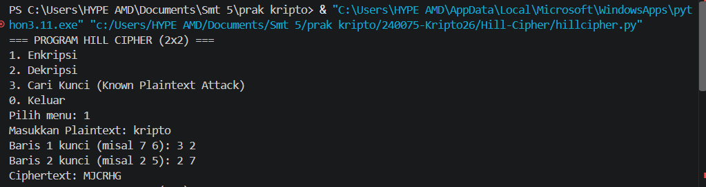
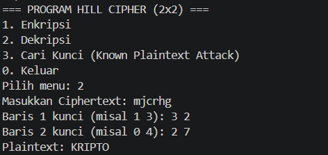
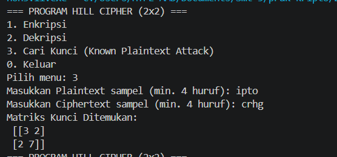

Nama : Rehan Aziz Hardiansyah

NPM  : 140810240075

==================================================

DESKRIPSI PROGRAM
Program ini menggunakan bahasa pemrograman Python untuk mensimulasikan algoritma kriptografi Hill Cipher ordo 2x2. Fitur utama program mencakup enkripsi plaintext, dekripsi ciphertext, dan pencarian matriks kunci menggunakan teknik Known Plaintext Attack (KPA).

==================================================

ALUR PROGRAM

Program menampilkan menu utama (1. Enkripsi, 2. Dekripsi, 3. Cari Kunci, 0. Keluar).

Pengguna memasukkan pilihan menu:

Pilih 1 (Enkripsi): Program menerima masukan plaintext dan matriks kunci (2x2), mengubah huruf menjadi matriks angka, mengalikan dengan kunci, lalu menghitung modulo 26 untuk menghasilkan ciphertext.

Pilih 2 (Dekripsi): Program menerima masukan ciphertext dan matriks kunci (2x2), mencari determinan, mencari invers determinan mod 26, membentuk matriks invers kunci, lalu mengalikkannya dengan ciphertext untuk mengembalikan plaintext.

Pilih 3 (Cari Kunci/KPA): Program menerima sampel plaintext dan ciphertext (minimal 4 huruf), mencari invers matriks plaintext mod 26, dan mengalikannya dengan matriks ciphertext untuk menemukan matriks kunci.

Pilih 0 atau Input Salah: Program menampilkan peringatan dan otomatis berhenti dari perulangan.

==================================================

CARA MENJALANKAN PROGRAM

Install modul Numpy:
pip install numpy

Jalankan file utama melalui terminal/command prompt:
python main.py

==================================================

SCREENSHOT RUNNING PROGRAM
Enkripsi :

Deskripsi :

Key Find :

