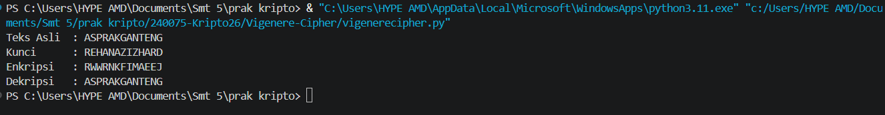

### Nama : Rehan Aziz Hardiansyah
### NPM  : 140810240075

==================================================

# DESKRIPSI PROGRAM
Program ini menggunakan bahasa pemrograman Python untuk mensimulasikan algoritma kriptografi vigenere cipher. Fitur utama program mencakup enkripsi plaintext dan dekripsi ciphertext.

==================================================

# ALUR PROGRAM

### 1. Inisialisasi Kunci
* Kunci diubah menjadi huruf kapital (`.upper()`) agar perhitungan nilai geser konsisten.
* Indeks kunci diatur mulai dari `0` untuk mencocokkan setiap huruf teks dengan huruf kunci secara berurutan.

### 2. Iterasi Karakter Teks
Program memeriksa setiap karakter dalam teks input satu per satu:

* **Kondisi A: Karakter adalah Huruf (A-Z / a-z)**
  1. Penentuan Titik Awal (`start`)**: Memeriksa apakah karakter huruf kapital (`'A'`) atau huruf kecil (`'a'`).
  2. Perhitungan Nilai Kunci (`shift`)**: Menghitung jarak huruf kunci relatif terhadap huruf `'A'` (misal: A=0, B=1, C=2, dst.). Kunci diulang menggunakan operasi modulo `key_index % len(key)`.
  3. Transformasi Karakter**:
     * **Enkripsi**: $C = (P + K) \bmod 26$
     * **Dekripsi**: $P = (C - K + 26) \bmod 26$
  4. Pembaruan Indeks**: Indeks kunci bertambah `+1` untuk memproses huruf berikutnya.

* **Kondisi B: Karakter Non-Alfabet (Spasi, Angka, Simbol)**
  1. Karakter dimasukkan langsung ke hasil tanpa diubah.
  2. Indeks kunci **tidak bertambah** agar urutan perulangan kunci tidak terganggu.

### 3. Penggabungan Hasil
* Semua karakter hasil transformasi digabungkan kembali menjadi satu string teks (*ciphertext* atau *plaintext*).

==================================================

# SCREENSHOT RUNNING PROGRAM

*pembuatan code dibantu gemini